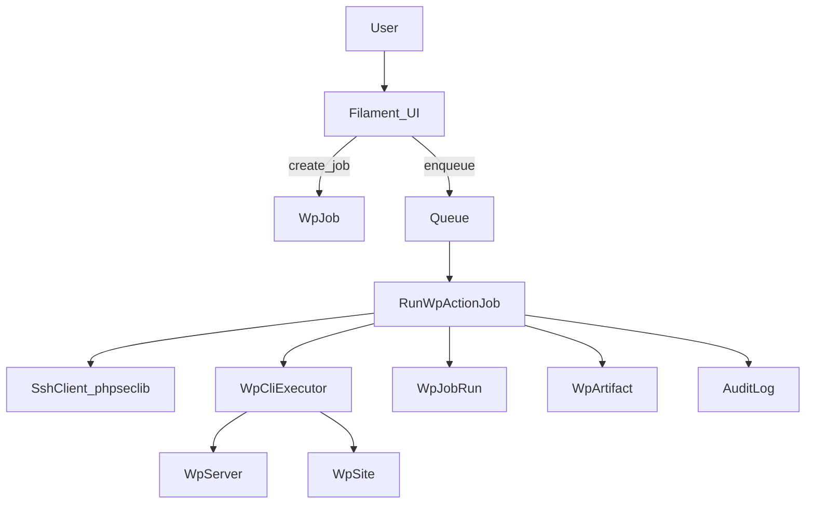

# WP Manager (in-app module) — detailed build plan

## Product decision

Build WP Manager **inside the existing Domain Monitor Laravel app** (shared auth/roles), but as a **strictly isolated module** so it can be extracted later.

- **UI**: Filament
- **Remote execution**: phpseclib (no system `ssh` calls)
- **Execution**: Queue-only (no long-running HTTP)
- **Security**: whitelisted action templates only, approval workflow for production apply, site lock guardrails, full audit trail

---

## Architecture boundaries (module isolation)

Create a module-style namespace and folder layout:

- `app/WpManager/` (all WP Manager code)
  - `Actions/` (action definitions + parameter schemas)
  - `DTO/` (job payload/result DTOs)
  - `Enums/` (statuses, modes, action keys)
  - `Models/` (WpServer, WpSite, WpJob, WpJobRun, WpArtifact)
  - `Policies/` (RBAC)
  - `Services/` (SSH, WP-CLI exec, action runner, backups, parsing)
  - `Jobs/` (RunWpActionJob)
  - `Support/` (helpers: path validation, argument escaping, redaction)
- `database/migrations/wp_manager/` (optional subfolder; otherwise keep normal migrations but prefixed)
- `config/wp_manager.php`
- Filament:
  - `app/Filament/WpManager/` (Panel/Resources/Pages/Widgets)

**Rule**: Domain Monitor code may *link* to WP Manager via `wp_sites.domain_id` optional FK, but must not depend on WP Manager internals.

---

## Data model (migrations)

Implement these tables (prefix to avoid collisions and enable extraction):

### `wp_servers`

- `id` (uuid)
- `name` (string)
- `host` (string)
- `port` (unsignedSmallInteger, default 22)
- `ssh_user` (string)
- `auth_method` (enum: `key_path`, `encrypted_key`, `agent` (optional))
- `ssh_key_path` (nullable string) **OR** `ssh_key_encrypted` (nullable text)
- `ssh_key_passphrase_encrypted` (nullable text)
- `known_hosts_enforced` (bool default true)
- `host_fingerprint` (nullable string) (pin if you want strict host verification)
- `notes` (nullable text)
- timestamps

### `wp_sites`

- `id` (uuid)
- `wp_server_id` (uuid FK)
- `domain_id` (nullable uuid FK to `domains.id`)
- `name` (string)
- `primary_domain` (string)
- `wp_path` (string) (absolute path)
- `environment` (enum: `prod`, `stage`, `dev`)
- `is_locked` (bool default false)
- `notes` (nullable text)
- timestamps

### `wp_jobs`

- `id` (uuid)
- `wp_site_id` (uuid FK)
- `action_key` (string)
- `status` (enum: `queued`, `running`, `succeeded`, `failed`, `cancelled`)
- `requested_by_user_id` (uuid/int FK to users)
- `approved_by_user_id` (nullable)
- `approved_at` (nullable datetime)
- `requested_at` (datetime)
- `meta` (json) (e.g. client ip, user agent)
- timestamps

### `wp_job_runs`

- `id` (uuid)
- `wp_job_id` (uuid FK)
- `mode` (enum: `dry_run`, `apply`)
- `status` (enum: `running`, `succeeded`, `failed`)
- `started_at`, `finished_at` (nullable)
- `exit_code` (nullable int)
- `stdout` (longText)
- `stderr` (longText)
- `structured_result` (json)
- `redactions` (json) (what was redacted)
- timestamps

### `wp_artifacts`

- `id` (uuid)
- `wp_job_run_id` (uuid FK)
- `type` (enum: `db_backup`, `report`, `log`, `diff`)
- `disk` (string) (e.g. `private`)
- `path` (string)
- `meta` (json)
- timestamps

Indexes:

- `wp_jobs (wp_site_id, created_at)`
- `wp_job_runs (wp_job_id, started_at)`
- `wp_sites (wp_server_id, environment)`

---

## Config + secrets

Create `config/wp_manager.php`:

- SSH:
  - default port, connect timeout, command timeout
  - host key verification mode (`known_hosts`, `pinned_fingerprint`, `none` (disallow in prod))
- Queues:
  - queue name for WP actions
- Backups:
  - remote backup directory root (e.g. `/backups/wp-manager/{site}/{timestamp}.sql`)
  - local artifact disk + retention
- Guardrails:
  - max stdout/stderr bytes stored
  - require dry-run for apply for certain actions

**Secret storage policy**:

- Prefer `ssh_key_path` referencing a securely permissioned key on the app host (ops-managed).
- If storing keys in DB, use Laravel encryption (encrypted cast) and restrict access.
- Never log secrets; redact `find/replace` values when configured.

---

## RBAC / policies

Use Laravel policies + abilities. Define abilities such as:

- `wp.view`
- `wp.manage_servers`
- `wp.manage_sites`
- `wp.run_dry_run`
- `wp.request_apply`
- `wp.approve_apply_prod`
- `wp.run_apply`
- `wp.override_site_lock`

Guardrails:

- **Locked sites**: allow dry-run; apply requires `wp.override_site_lock`.
- **Production apply**: requires separate approval by a different user with `wp.approve_apply_prod`.
- **Two-person rule**: approver must not equal requester.

---

## Action system (whitelisted templates)

Represent actions as code-defined classes (catalogue). Each action defines:

- `key` (string/enum)
- parameter schema (typed, validated)
- allowed modes (dry_run/apply)
- whether dry-run is required before apply
- whether backup is required before apply
- WP-CLI command template(s) built from **escaped args only**
- optional post-steps (cache flush)

### Initial actions

Implement these first:

1) **search_replace** (end-to-end)

- Inputs: `find`, `replace`, `scope` (`all_tables`/`wp_tables`)
- Dry-run template:
  - `wp search-replace {find} {replace} --dry-run --precise --recurse-objects --report-changed-only` + scope flag
- Apply template:
  - same without `--dry-run`
- Rules:
  - must have a successful dry-run run linked to job before apply
  - must create DB backup before apply
  - optional `wp cache flush` after apply

2) **db_export**

- `wp db export {remote_path}`

3) **plugin_list**

- `wp plugin list --format=json`

4) **health_snapshot**

- Gather: `wp core version`, `wp option get siteurl`, `wp option get home`, plugin count, updates available
- Output structured JSON

(Defer plugin/core updates until approvals UI is solid.)

---

## Remote execution services (phpseclib)

### `SshClient`

- Connect using server config
- Enforce timeouts
- Host key verification (based on config)
- Execute command and capture stdout/stderr/exit code
- Optional SFTP for pulling artifacts (or store remote path and fetch later)

### `WpCliExecutor`

- Responsible for:
  - validating `wp_path` is absolute + normalized
  - setting working directory (simulate by `cd` prefix within a fixed template; not user-provided)
  - adding `--path={wp_path}` to WP-CLI if preferred, to avoid `cd`
  - ensuring `wp` is available (health check action)

### `ActionRunner`

- Converts action DTO → WP-CLI command(s)
- Applies guardrails:
  - dry-run prerequisite check
  - backup prerequisite check
  - prod approval check
  - locked site check
- Runs backup step when required
- Collects results and passes through `ResultParser`

### `BackupService`

- Executes `wp db export` to a remote path
- Produces a `wp_artifacts` record
- Optionally pulls backup to local disk for retention (v2)

### `ResultParser`

- Action-specific parsing into structured JSON
- Normalize common fields:
  - `changed_count`, `warnings`, `duration_ms`, `command`

---

## Queue jobs + workflow

### `RunWpActionJob`

- Input DTO includes `wp_job_id`, `mode`, and action params (validated at request time)
- Steps:
  - Mark job/run running
  - Acquire a per-site lock (cache/DB) to prevent concurrent apply on the same site
  - Execute backup (if needed)
  - Execute action
  - Persist stdout/stderr (bounded) + structured result
  - Persist artifacts
  - Mark run/job status

### Approval flow

- Dry-run creates a job and a `dry_run` run.
- Apply request creates/updates a job to “pending approval” (or a dedicated status) and stores requested params.
- Approver approves (records approver + time), then triggers apply job.

---

## Filament UI (Panel/Resources)

Create a Filament “WP Manager” area:

- **Servers** (`WpServerResource`)
  - CRUD
  - “Test connection” action (queued or short timeout) that runs `whoami` + `wp --info` optional

- **Sites** (`WpSiteResource`)
  - CRUD
  - lock toggle
  - optional link to `domains` via select

- **Jobs** (`WpJobResource`)
  - list/filter by site/status/action
  - detail page shows runs, artifacts, stdout/stderr (redacted), structured result

- **Run Action page** (per site)
  - choose action
  - render validated inputs
  - “Run dry-run” button
  - show dry-run report
  - “Request apply” button (prod triggers approval requirement)
  - “Approve” (only approvers) + “Run apply”

**UX guardrails**:

- Apply buttons disabled unless prerequisites satisfied
- Clear banners for prod/locked

---

## Logging + audit

- Add dedicated audit logging for:
  - job created/requested
  - approval granted/denied
  - execution started/finished
  - artifacts created
- Ensure logs redact sensitive parameters when configured.

---

## Testing plan (PHPUnit)

Add unit tests (no network):

- **Action template building**
  - parameters are escaped
  - correct flags for dry-run/apply

- **Guardrails**
  - dry-run required before apply
  - backup required before apply
  - locked site blocks apply without override
  - prod apply requires approval and different approver

- **Parsing**
  - parse sample WP-CLI outputs into structured results

Use fakes:

- `FakeSshClient` that returns deterministic stdout/stderr/exit codes

---

## CI / quality gates

Extend existing GitHub Actions workflow to include WP Manager checks if needed (most should already be present):

- Pint
- PHPStan/Larastan strict enough to catch generics issues
- PHPUnit

Add minimum standards:

- new module must be fully typed (DTOs, return types)
- no direct `exec/shell_exec` usage

---

## Phased delivery (recommended)

### Phase 1 — Foundations

- Models + migrations
- Policies/abilities
- Filament resources for Servers/Sites (CRUD)

### Phase 2 — Execution core

- phpseclib SSH client
- WP-CLI executor + runner framework
- Job/run persistence + artifacts

### Phase 3 — First end-to-end action

- Implement `search_replace` with:
  - dry-run
  - backup-before-apply
  - apply + optional cache flush
- Filament run screen + approval flow

### Phase 4 — Reporting

- Job history dashboards
- Artifacts browsing/download
- Structured results display

### Phase 5 — Expand catalogue

- health_snapshot
- plugin_list
- (later) plugin/core update with prod approval

---

## Key files to create/change (initial set)

- `config/wp_manager.php`
- `app/WpManager/Models/*`
- `app/WpManager/Enums/*`
- `app/WpManager/DTO/*`
- `app/WpManager/Services/SshClient.php`
- `app/WpManager/Services/WpCliExecutor.php`
- `app/WpManager/Services/ActionRunner.php`
- `app/WpManager/Actions/SearchReplaceAction.php`
- `app/WpManager/Jobs/RunWpActionJob.php`
- `app/WpManager/Policies/*`
- `app/Filament/WpManager/*`
- `database/migrations/*_create_wp_*_tables.php`
- `tests/Unit/WpManager/*`

---

## Mermaid: high-level flow

